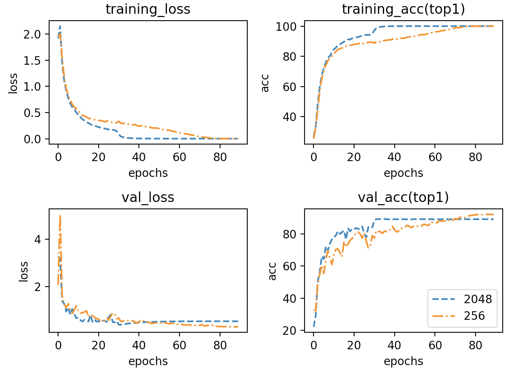
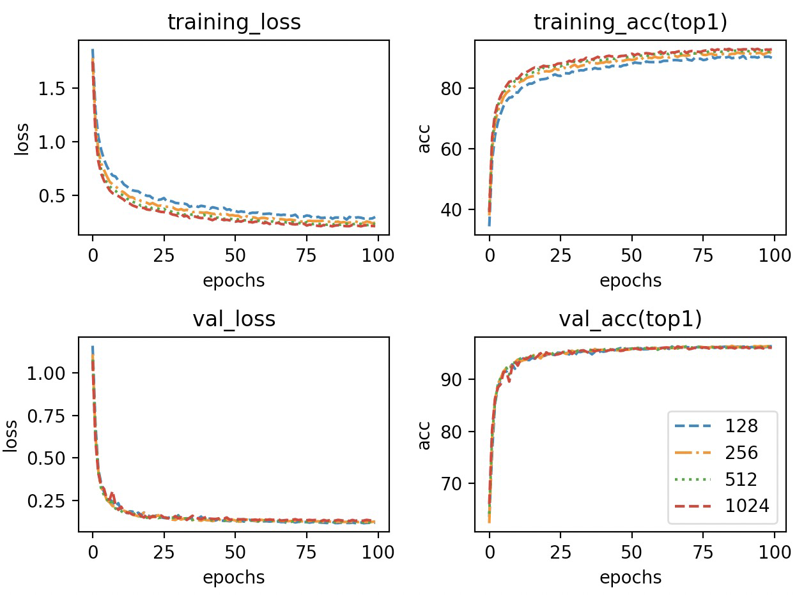
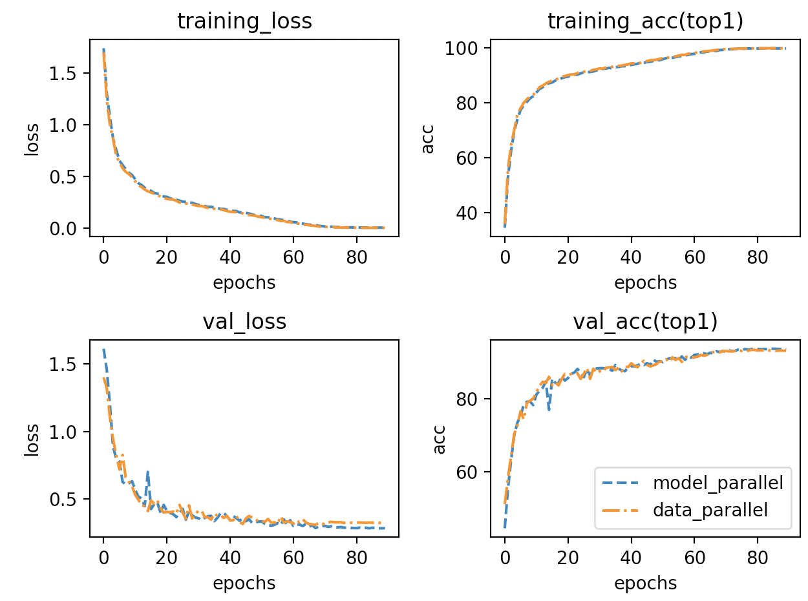

# Difference about nn.Dataparallel and nn.distributed
## Conclusion
learned a lot from https://zhuanlan.zhihu.com/p/343951042
1. `Dataparallel` uses one process and multiple threads, `distributed` uses multi process,multiple threads may cause threashing.
2. `distributed` could be used for multiple device training(like CPU and GPU)
3. `distributed` has special comment about sparse gradient?
4. `paralel_apply` is used by both
5. communication cost is higher for DP when GPU number is more.Ring AllReduce is used,(one time reduce one bucket). Also parameters are separated in buckets.
6. `Dataparallel` take more cost on device[0](gather and scatter)

## Dataparallel
https://github.com/pytorch/pytorch/blob/master/torch/nn/parallel/data_parallel.py
```
 inputs, kwargs = self.scatter(inputs, kwargs, self.device_ids)
```
```
            replicas = self.replicate(self.module, self.device_ids[:len(inputs)])
            outputs = self.parallel_apply(replicas, inputs, kwargs)
            return self.gather(outputs, self.output_device)

```
`scatter` separate tensors for different GPUs.\
`scatter` use C++ backend
`replicas` means copy model, inputs, and network buffers to multy GPUs,uses `Broadcast`  `comm.broadcast_coalesced` function
```
   class Broadcast(Function):

    @staticmethod
    def forward(ctx, target_gpus, *inputs):
        assert all(i.device.type != 'cpu' for i in inputs), (
            'Broadcast function not implemented for CPU tensors'
        )
        target_gpus = [_get_device_index(x, True) for x in target_gpus]
        ctx.target_gpus = target_gpus
        if len(inputs) == 0:
            return tuple()
        ctx.num_inputs = len(inputs)
        # input 放在 device[0]
        ctx.input_device = inputs[0].get_device()

        # 和 detach 的情况一样
        outputs = comm.broadcast_coalesced(inputs, ctx.target_gpus)

        # comm.broadcast_coalesced 的代码
        # tensors 必须在同一个设备，CPU 或者 GPU； devices 即是要拷贝到的设备；buffer_size 则是最大的buffer
        # 这里用到 buffer 将小张量合并到缓冲区以减少同步次数
        # def broadcast_coalesced(tensors, devices, buffer_size=10485760):
        #    devices = [_get_device_index(d) for d in devices]
            #       return torch._C._broadcast_coalesced(tensors, devices, buffer_size)

        non_differentiables = []
        for idx, input_requires_grad in enumerate(ctx.needs_input_grad[1:]):
            if not input_requires_grad:
                for output in outputs:
                    non_differentiables.append(output[idx])
        ctx.mark_non_differentiable(*non_differentiables)
        return tuple([t for tensors in outputs for t in tensors])

    @staticmethod
    def backward(ctx, *grad_outputs):
        return (None,) + ReduceAddCoalesced.apply(ctx.input_device, ctx.num_inputs, *grad_outputs)
```
`parallel apply` means separately get the gradient and make an avergae of them.\
parallel use threading to execute models and gather each models output\
```
    def _worker(i, module, input, kwargs, device=None):
        torch.set_grad_enabled(grad_enabled)
        if device is None:
            device = get_a_var(input).get_device()
        try:
            with torch.cuda.device(device), autocast(enabled=autocast_enabled):
                # this also avoids accidental slicing of `input` if it is a Tensor
                if not isinstance(input, (list, tuple)):
                    input = (input,)
                output = module(*input, **kwargs)
            with lock:
              # 并行计算得到输出
                results[i] = output
        except Exception:
            with lock:
                results[i] = ExceptionWrapper(
                    where="in replica {} on device {}".format(i, device))
```
```
    if len(modules) > 1:


        threads = [threading.Thread(target=_worker,
                                    args=(i, module, input, kwargs, device))
                   for i, (module, input, kwargs, device) in
                   enumerate(zip(modules, inputs, kwargs_tup, devices))]

        for thread in threads:
            thread.start()
        for thread in threads:
            thread.join()
    else:
        # DDP favors this
        _worker(0, modules[0], inputs[0], kwargs_tup[0], devices[0])
```
`gather` get those computed tensors and average them
```
class Gather(Function):

    @staticmethod
    def forward(ctx, target_device, dim, *inputs):
        assert all(i.device.type != 'cpu' for i in inputs), (
            'Gather function not implemented for CPU tensors'
        )

        target_device = _get_device_index(target_device, True)

        ctx.target_device = target_device

        ctx.dim = dim
        ctx.input_gpus = tuple(i.get_device() for i in inputs)

        if all(t.dim() == 0 for t in inputs) and dim == 0:
            inputs = tuple(t.view(1) for t in inputs)
            warnings.warn('Was asked to gather along dimension 0, but all '
                          'input tensors were scalars; will instead unsqueeze '
                          'and return a vector.')
            ctx.unsqueezed_scalar = True
        else:
            ctx.unsqueezed_scalar = False
        ctx.input_sizes = tuple(i.size(ctx.dim) for i in inputs)
        return comm.gather(inputs, ctx.dim, ctx.target_device)

    @staticmethod
    def backward(ctx, grad_output):
        scattered_grads = Scatter.apply(ctx.input_gpus, ctx.input_sizes, ctx.dim, grad_output)
        if ctx.unsqueezed_scalar:
            scattered_grads = tuple(g[0] for g in scattered_grads)
        return (None, None) + scattered_grads
```
backend 
## nn.distributed
https://github.com/pytorch/pytorch/blob/master/torch/nn/parallel/distributed.py
```
def _ddp_init_helper(self):
```


# About bn and large batch training
I tried to remove all batch_norm layers in MobileNetV2. Here are my settings.
|  Model   | MobilenetNetV2(without bn layers) |
|  ----  | ----  |
| Dataset  | CIFAR10 |
| lr  | 0.2,0.8 |
| batch_size| 512,2048|
| optimizer| SGD|
| scheduler| Linear decay |
|weight decay|1e-4|





# Correction of 512 batch size training

In the last part, I got a wrong picture about finetune in different batch size.
And here is the correction.
## Settings
|  Model   | MobilenetNetV2  |
|  ----  | ----  |
| Dataset  | CIFAR10 |
| lr  | 0.2,0.8 |
| batch_size| 512,2048|
| optimizer| SGD|
| scheduler| Cosinannealing with linear warm up
|weight decay|1e-4

## Acc vs batchsize

> | Batchsize | Acc1_validation |
> | --------- | --------------- |
> | 128       | 95.3%           |
> | 256       | 95.1%           |
> | 512       | 94.9%           |
> | 1024      | 94.1%           |
>
> 



bigger batch size get better results on training datasets, while performs worse than smaller batch size in validation datasets.

# Distributed training(model parallel)

## Settings

| Model              | MobileNetV2(from kuangliiu's repo) |
| ------------------ | ---------------------------------- |
| Image              | 32*32                              |
| Dataset            | CIFAR10                            |
| Distributed method | Model parallel                     |
| GPU number         | 4                                  |
| Optimizer          | SGD                                |
| lr                 | 0.4                                |
| Batchsize          | 512                                |
| Scheduler          | Cosannealing                       |
| Dist pachage       | pytorch rpc,nccl                   |

## API

```python
class ForwardSend_BackwardReceive(autograd.Function):
    @staticmethod
    def forward(ctx,input:torch.tensor,from_rank:int,to_rank:int,self_rank:int):
        ctx.save_for_backward(torch.tensor(from_rank),torch.tensor(to_rank),torch.tensor(self_rank))
        dist.send((torch.tensor(input.dim())*torch.tensor(1.0)).to(self_rank), to_rank)
        dist.send((torch.tensor(input.size())*torch.tensor(1.0)).to(self_rank), to_rank)
        dist.send(input, to_rank)
        #print("forward send",input.shape,"from",self_rank,"to",to_rank)
        return input
    @staticmethod
    def backward(ctx, grad_output):
        from_rank,to_rank,self_rank = ctx.saved_tensors
        dim = torch.tensor(1.0).cuda(int(self_rank))
        dist.recv(dim,int(from_rank))
        size = torch.rand(int(dim)).cuda(int(self_rank))
        dist.recv(size,int(from_rank))
        output = torch.rand(tuple(size.int())).cuda(int(self_rank))
        dist.recv(output,int(from_rank))
        #print("backward recv",output.shape,"from",from_rank,"to",self_rank)
        return output,None,None,None

def generate_recv(from_rank:int,self_rank:int):
    dim = torch.tensor(1.0).cuda(self_rank)
    dist.recv(dim,from_rank)
    size = torch.rand(int(dim)).cuda(self_rank)
    dist.recv(size,from_rank)
    output = torch.rand(tuple(size.int())).cuda(self_rank)
    output = output.requires_grad_()
    return output
class ForwardReceive_BackwardSend(autograd.Function):
    @staticmethod
    def forward(ctx,input:torch.tensor,from_rank:int,to_rank:int,self_rank:int):
        ctx.save_for_backward(torch.tensor(from_rank),torch.tensor(to_rank),torch.tensor(self_rank))
        dist.recv(input,from_rank)
        #print("forward recv",input.shape,"from",from_rank,"to",self_rank)
        return input*1.0
    @staticmethod
    def backward(ctx,grad_output):
        from_rank,to_rank,self_rank = ctx.saved_tensors
        dist.send((torch.tensor(grad_output.dim())*torch.tensor(1.0)).to(int(self_rank)), int(to_rank))
        dist.send((torch.tensor(grad_output.size())*torch.tensor(1.0)).to(int(self_rank)), int(to_rank))
        dist.send(grad_output, int(to_rank))
        #print("backward send",grad_output.shape,"from",self_rank,"to",to_rank)
        return grad_output,None,None,None
```

## dataparallel vs modelparallel

in here we use 4GPUs, and I mannually separate the model, it might be brutal.

| Item          | Modelparallel | Dataparallel |
| ------------- | ------------- | ------------ |
| Acc           | 93.3%         | 93.8%        |
| Time_perbatch | 1.616s        | 0.396s       |



